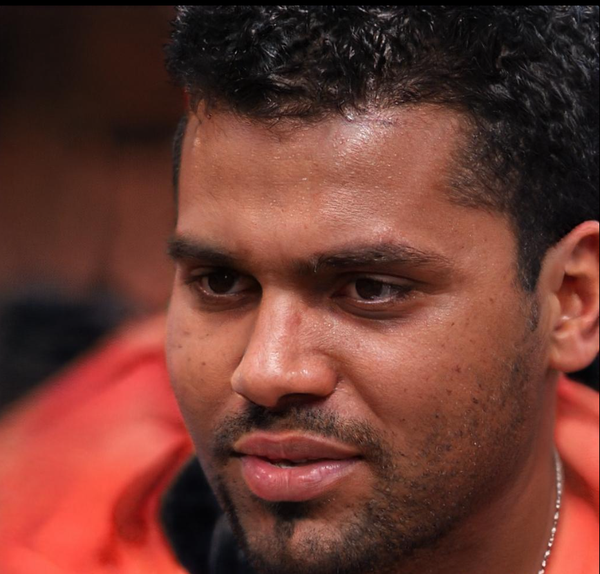

# Especificações do Projeto

Tendo em vista a rotina agitada e com limitações de tempo, o projeto tem como objetivo atender pessoas que objetivam se informar e compartilhar informações de diferentes fontes, sem que seja necessário acessar diversos portais de notícia e trazendo mais praticidade para essa atividade.

## Personas

As personas levantadas durante o processo de entendimento do problema são apresentadas na Figuras que se seguem:

Lucas Souza possui 25 anos, é editor de vídeo autônomo. Pensa em mudar de carreira para a área de animação 3d, estudando e praticando sobre o assunto na parte da noite. No tempo livre gosta de assistir séries e filmes, jogar video-game e sair para correr. Utiliza as redes LinkedIN e Instagram. Se interessa em notícias relacionadas a política, tecnologia e cultura pop.

Cláudia Moura possui 39 anos, é advogada e mãe de 2 filhos. Possui alta carga de trabalho, além das responsabilidades como mãe. No tempo livre, gosta de passar um tempo com a família, ir a praia e ir ao cinema. Não utiliza redes sociais, apenas aplicativos de mensagem instantânea. Se interessa por notícias relacionadas a política, cultura e acontecimentos diários.

Igor Silva 30 anos, formado em logística, trabalha na área durante o dia e estuda para concursos na parte da noite. No tempo livre, gosta de jogar e assistir futebol, acompanhar canais no Youtube e ir a shows de música. Utiliza o Facebook, Instagram e Youtube. Se interessa por notícias relacionadas a futebol, eventos, concursos públicos e acontecimentos diários.

## Histórias de Usuários

Com base na análise das personas forma identificadas as seguintes histórias de usuários:

|EU COMO... `PERSONA`| QUERO/PRECISO ... `FUNCIONALIDADE` |PARA ... `MOTIVO/VALOR`                 |
|--------------------|------------------------------------|----------------------------------------|
|Lucas Souza         | Notícias Relacionadas às minhas áreas de interesse    | Não perder tempo com notícias que não me interessam|
|Lucas Souza         | Sistema de "likes"                 | Ranquear as notícias de acordo com minhas preferências         |
|Igor Silva          | Notícias de todos os tipos e fontes| Unificar todos seus interesses em um único espaço, sem a necessidade de acessar vários portais  |
|Igor Silva          | Filtro de notícias         | Buscar as notícias que me interessam em determinado momento |
|Cláudia Moura       | Acessar o site pelo celular ou computador  | Aproveitar momentos de ócio para acompanhar as notícias, independente de aonde estiver      |
|Cláudia Moura       | Adicionar notícias ao site            | Compartilhar notícias de seu interesse com usuários que tenham gostos parecidos |

## Requisitos

As tabelas que se seguem apresentam os requisitos funcionais e não funcionais que detalham o escopo do projeto.

### Requisitos Funcionais

|ID    | Descrição do Requisito  | Prioridade |
|------|-----------------------------------------|----|
|RF-001| Permitir que o usuário cadastre tarefas | ALTA | 
|RF-002| Emitir um relatório de tarefas no mês   | MÉDIA |

### Requisitos não Funcionais

|ID     | Descrição do Requisito  |Prioridade |
|-------|-------------------------|----|
|RNF-001| O sistema deve ser responsivo para rodar em um dispositivos móvel | MÉDIA | 
|RNF-002| Deve processar requisições do usuário em no máximo 3s |  BAIXA | 

Com base nas Histórias de Usuário, enumere os requisitos da sua solução. Classifique esses requisitos em dois grupos:

- [Requisitos Funcionais
 (RF)](https://pt.wikipedia.org/wiki/Requisito_funcional):
 correspondem a uma funcionalidade que deve estar presente na
  plataforma (ex: cadastro de usuário).
- [Requisitos Não Funcionais
  (RNF)](https://pt.wikipedia.org/wiki/Requisito_n%C3%A3o_funcional):
  correspondem a uma característica técnica, seja de usabilidade,
  desempenho, confiabilidade, segurança ou outro (ex: suporte a
  dispositivos iOS e Android).
Lembre-se que cada requisito deve corresponder à uma e somente uma
característica alvo da sua solução. Além disso, certifique-se de que
todos os aspectos capturados nas Histórias de Usuário foram cobertos.

## Restrições

O projeto está restrito pelos itens apresentados na tabela a seguir.

|ID| Restrição                                             |
|--|-------------------------------------------------------|
|01| O projeto deverá ser entregue até o final do semestre |
|02| Não pode ser desenvolvido um módulo de backend        |

Enumere as restrições à sua solução. Lembre-se de que as restrições geralmente limitam a solução candidata.

> **Links Úteis**:
> - [O que são Requisitos Funcionais e Requisitos Não Funcionais?](https://codificar.com.br/requisitos-funcionais-nao-funcionais/)
> - [O que são requisitos funcionais e requisitos não funcionais?](https://analisederequisitos.com.br/requisitos-funcionais-e-requisitos-nao-funcionais-o-que-sao/)
