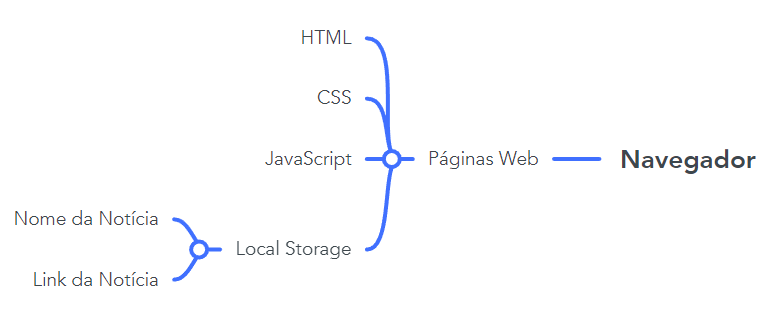

# Arquitetura da Solução

A aplicação se trata de um portal de notícias onde os usuários irão enviar os links das nóticas e estas serão exibidas em um ambiente externo a aplicação. Desta forma os dados que deverão ser guardados serão os dados de usuários, nome da notícia e link da notícia.

## Diagrama de componentes

Os componentes estão relacionados da seguinte maneira.

A solução implementada conta com os seguintes módulos:
- **Navegador** - Interface básica do sistema  
  - **Páginas Web** - Conjunto de arquivos HTML, CSS, JavaScript e imagens que implementam as funcionalidades do sistema.
   - **Local Storage** - armazenamento mantido no Navegador, onde são implementados bancos de dados baseados em JSON. São eles: 
     - **Usuários** - resgistro de usuários; 
     - **Nomes das notícias** - registro dos nomes que os usuários atribuirão as notícias postadas;
     - **Links das notícias** - resgistro do link em que a notícia postada se encontra.
 - **News API** - plataforma que permite o acesso às notícias exibidas no site.
 - **Hospedagem** - local na Internet onde as páginas são mantidas e acessadas pelo navegador. 

## Diagrama de Solução

A imagem a seguir ilustra a o fluxo do usuário em nossa solução. Assim
que o usuário entra na plataforma, ele tem acesso a todas as notícias já postadas. Podendo assim somente acessar notícias.

Caso ele opte em fazer parte da comunidade e passar enviar notícas sobre tecnologia que ele julgue interessante, ele primeiramente precisará realizar o log in na aplicação. Caso ele ainda não tenha, precisará inserir o nome, e-mail e senha para assim realizar seu cadastro.

Após o usuário realizar o log in na aplicação, o cabeçalho terá uma leva alteração onde irá ser exibido o nome completo do usuário (informação inserida no momento do cadastro), um botão de log out caso ele queira sair da aplicação e um botão para ele enviar notícias.

Caso ele clique no botão de enviar notícias, ele deverá inserir o nome da notícia que ele esta enviando e o link da notícia.

Essa notícia então passará a ser exibida na tela principal e todos os usuários terão acesso a ela.

## Tecnologias Utilizadas

Descreva aqui qual(is) tecnologias você vai usar para resolver o seu problema, ou seja, implementar a sua solução. Liste todas as tecnologias envolvidas, linguagens a serem utilizadas, serviços web, frameworks, bibliotecas, IDEs de desenvolvimento, e ferramentas.

Apresente também uma figura explicando como as tecnologias estão relacionadas ou como uma interação do usuário com o sistema vai ser conduzida, por onde ela passa até retornar uma resposta ao usuário.

## Hospedagem

Explique como a hospedagem e o lançamento da plataforma foi feita.

> **Links Úteis**:
>
> - [Website com GitHub Pages](https://pages.github.com/)
> - [Programação colaborativa com Repl.it](https://repl.it/)
> - [Getting Started with Heroku](https://devcenter.heroku.com/start)
> - [Publicando Seu Site No Heroku](http://pythonclub.com.br/publicando-seu-hello-world-no-heroku.html)
