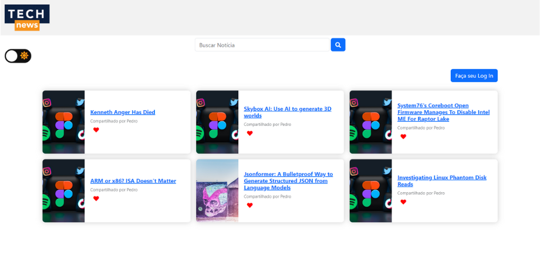
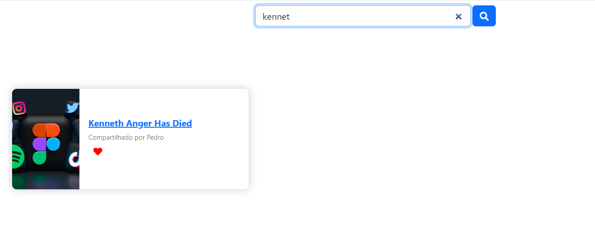
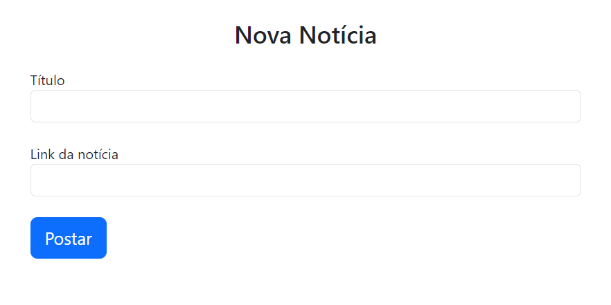
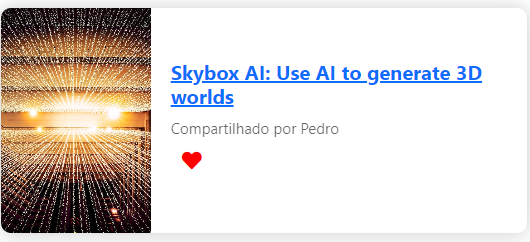
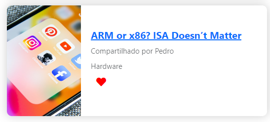
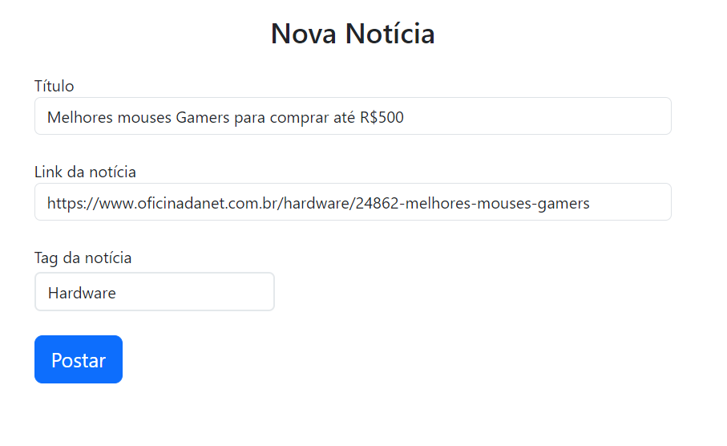
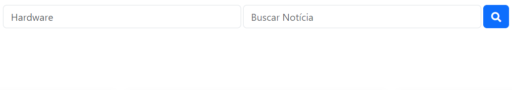

# Programação de Funcionalidades


Nesta seção serão apresentadas as telas desenvolvidas para cada funcionalidade da solução. Para acessar a aplicação, ativamos uma API do JSON e o local storage, através do terminal do Visual Studio CODE.


# Redirecionamento do Usuário a Fonte da Notícia (RF-001)

A tela principal do site exibe as notícias mais recentes que foram postadas. Ao clicar no card, o usuário é redirecionado para a fonte da notícia, abrindo outra aba do navegador.

> - 

## Artefatos da Funcionalidade

- index.html (Pedro Batista)

- generate_and_search_card_news.js (Pedro Batista, Pedro Aguilar)

- db.json (Pedro Batista, Luca Barbosa)

- style.css (Pedro Batista, Pedro Aguilar, João Ricardo)

### Estrutura de Dados

```
  <main class="container">
    <div class="d-flex justify-content-between my-4">
      <a href="add_news.html">
        <button id="novaNoticiaButton" type="button" class="btn btn-primary">
          Nova notícia
        </button> <!-- Nova notícia button -->
      </a>
      <a href="./login.html">
        <button id="loginButton" type="button" class="btn btn-primary">
          Faça seu Log In
        </button>
      </a>
    </div>
    <!-- Popula dinamicamente usando JS -->
    <div class="cards"></div>
  </main>
```


# Filtro de Notícias (RF-002)

A tela principal apresenta uma caixa de busca, aonde o usuário pode digitar um título e pesquisar por notícias que tenham aquelas palavras em seu título.

> - 

## Artefatos da Funcionalidade

- index.html (Pedro Batista)

- generate_and_search_card_news.js (Pedro Batista, Pedro Aguilar)

- db.json (Pedro Batista, Luca Barbosa)

- style.css (Pedro Batista, Pedro Aguilar, João Ricardo)

### Estrutura de Dados

```
  function performSearch() {
    let query = searchInput.value.trim().toLowerCase();

    // Limpar resultados da busca anterior
    let searchResults = document.querySelector('.cards');
    searchResults.innerHTML = '';

    let matchingNewsItems = originalNewsItems.filter(function (newsItem) {
      let title = newsItem.title.toLowerCase();
      let sharedBy = newsItem.user.name.toLowerCase();
      return title.includes(query) || sharedBy.includes(query);
    });
```

# O Usuário Pode Alimentar o Site com Novas Notícias (RF-004)

Criando uma conta e logando na mesma, os usuários podem adicionar novas notícias ao site através do botão "Adicionar notícia".

> - 

## Artefatos da Funcionalidade

- add_news.html (Pedro Aguilar)

- generate_and_search_card_news.js (Pedro Batista, Pedro Aguilar)

- db.json (Pedro Batista, Luca Barbosa)

- style.css (Pedro Batista, Pedro Aguilar, João Ricardo)

- create_user.js (Pedro Batista)

- handleUserLoggedIn.js (Pedro Batista)

### Estrutura de Dados

```
"news": [
    {
        "title": "Investigating Linux Phantom Disk Reads",
        "url": "https://questdb.io/blog/investigating-linux-phantom-disk-reads/",
        "image": "https://source.unsplash.com/random/?technology",
        "createdAt": "2023-04-07T16:42:21.461Z",
        "userId": 1,
        "id": 1
    },
    // Outros itens de notícias...
]
```
# O Site Deve Exibir o Usuário que Postou a Notícia (RF-006)

Nos cards de notícia, gerados dinamicamente, é exibido o nome do usuário responsável pela postagem

> - 

## Artefatos da Funcionalidade

- index.html (Pedro Batista)

- generate_and_search_card_news.js (Pedro Batista, Pedro Aguilar)

- db.json (Pedro Batista, Luca Barbosa)

- style.css (Pedro Batista, Pedro Aguilar, João Ricardo)

- create_user.js (Pedro Batista, Willian Pereira)

### Estrutura de Dados

```
    let sharedBy = document.createElement('p');
    sharedBy.textContent = 'Compartilhado por ' + newsItem.user.name;
    cardNewsInfos.appendChild(sharedBy);
```

# Sistema de "likes" (RF-003)

Os usuários podem "curtir" as notícias que mais gostaram.

> - 

## Artefatos da Funcionalidade

- generate_and_search_card_news.js (Pedro Batista, Pedro Aguilar)

- index.html (Pedro Batista)

### Estrutura de Dados

```
    let likeButton = document.createElement('button');
    likeButton.classList.add('like-button');
    let likeIcon = document.createElement('i');
    likeIcon.classList.add('fas', 'fa-heart');
    likeButton.appendChild(likeIcon);
    cardNewsInfos.appendChild(likeButton);
```

# Sistema de tags (RF-005)

Ao cadastrar uma notícia, o usuário deve selecionar uma tag para atribuir à notícia; dessa forma, quando for realizar uma pesquisa, ele pode buscar apenas por notícias de algum nicho em específico.

> - 

> - 

## Artefatos da Funcionalidade

- index.html (Pedro Batista)

- add_news.html (Pedro Aguilar, Pedro Batista)

### Estrutura de Dados

```
            <div class="form-group mt-4" id="tagContainer">
              <label class="login-label" for="tag">Tag da notícia</label>
              <select id="tag" class="form-control login-field">
                <option value="Hardware">Hardware</option>
                <option value="AI">Inteligência Artificial</option>
                <option value="Software">Software</option>
              </select>
            </div>
```


