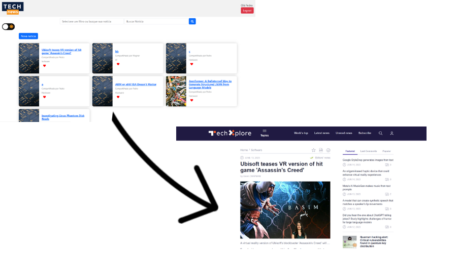
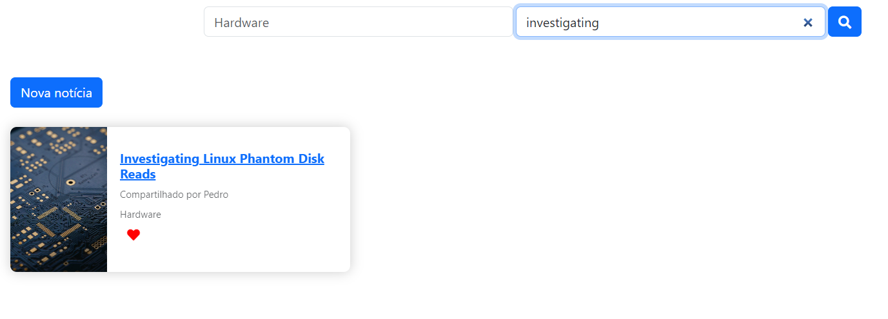

# Registro de Testes de Software

Seguem a seguir o resultado dos testes realizados:

## CT-1 - Redirecionamento para o site fonte da notícia

Ao clicar em uma notícia, o usuário é redirecionado à página de origem da notícia, como demonstrado na imagem abaixo:

> - 

## CT-2 - Pesquisa e filtro de notícias

Ao selecionar o filtro desejado e digitar o nome de uma notícia existente, o site exibe apenas os itens que atendem aos requisitos.

> - 

## CT- 3 Sistema de "likes"

Apesar do ícone ser gerado junto das notícias dinamicamente, ele ainda não efetua a contagem dos clickes; ainda necessita de ajustes finais.

> - 

## CT- 4 Postagem das notícias

As notícias criadas por usuários são geradas dinamicamente na home page com todas as informações inseridas no momento da postagem.

> - 

## CT- 5 O site deve exibir o usuário que postou a notícia

As notícias exibem o nome do usuário responsável pelo post.

> - 

## Avaliação

A avaliação dos resultados dos testes realizados revelou tanto pontos fortes quanto pontos fracos na solução do software em teste. Essa avaliação é essencial para identificar áreas que estão funcionando bem e aquelas que requerem melhorias. 

No teste CT-1, que envolve o redirecionamento para o site de origem da notícia, o resultado foi positivo. Ao clicar em uma notícia, o usuário é corretamente redirecionado para a página de origem da notícia. Isso indica que a funcionalidade está implementada adequadamente. 

Já no teste CT-2, que aborda a pesquisa e filtro de notícias, também foi obtido um resultado satisfatório. Ao selecionar um filtro e digitar o nome de uma notícia existente, o site exibiu apenas os itens que correspondiam aos critérios selecionados. Essa funcionalidade de filtragem é fundamental para melhorar a experiência do usuário ao procurar notícias específicas. Portanto, esse também é um ponto forte da solução.

No entanto, o teste CT-3 revelou uma falha na funcionalidade do sistema de "likes". Embora o ícone de "like" seja gerado corretamente junto com as notícias, a contagem de cliques ainda não está sendo efetuada. Essa é uma área que requer atenção e melhorias adicionais. É evidente necessidade de corrigir essa funcionalidade para que os usuários possam expressar suas preferências e para que o sistema possa exibir notícias populares com base nos "likes" recebidos.

Quanto ao teste CT-4, que avalia a postagem das notícias, os resultados foram satisfatórios. As notícias criadas pelos usuários são geradas dinamicamente na página principal, exibindo todas as informações inseridas no momento da postagem. Isso demonstra que a funcionalidade de adicionar notícias está funcionando corretamente. Essa é uma característica importante do sistema, pois permite que os usuários contribuam com conteúdo relevante para a comunidade. É fundamental continuar monitorando essa funcionalidade para garantir que as notícias sejam adicionadas e exibidas de forma adequada.

Por fim, o teste CT-5, que envolve a exibição do usuário responsável pela postagem da notícia, também obteve um resultado positivo. As notícias exibem o nome do usuário que as postou, o que contribui para a transparência e a credibilidade do sistema. Esse recurso é valioso, pois permite que os usuários identifiquem as fontes das notícias e estabeleçam confiança na plataforma.
