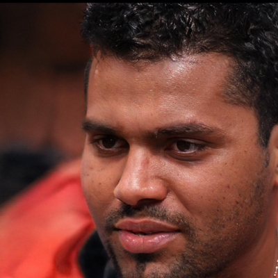

# Especificação do Projeto

Atualmente as notícias e informações são itens essenciais no dia a dia das pessoas e  organizações. As informações corretas, precisas e de fácil observação são fundamentais para se manter atualizado. 

Com o aumento do número de plataformas como sites, fóruns, blogs e jornais as pessoas acabaram perdendo o interesse em procurar novas notícias e informações pois muitas das vezes acabam encontrando inúmeras notícias que não tem relação com seus interesses, ou notícias enganosas.

Tendo em vista a rotina agitada e com limitações de tempo, o projeto tem como objetivo atender pessoas que objetivam se informar e compartilhar informações de diferentes fontes, sem que seja necessário acessar diversos portais de notícia e trazendo mais praticidade para essa atividade.

## Personas

As personas levantadas durante o processo de entendimento do problema são apresentadas na Figuras que se seguem:

Lucas Souza possui 25 anos, é editor de vídeo autônomo. Pensa em mudar de carreira para a área de animação 3d, estudando e praticando sobre o assunto na parte da noite. No tempo livre gosta de assistir séries e filmes, jogar video-game e sair para correr. Utiliza as redes LinkedIN e Instagram. Se interessa em notícias relacionadas a política, tecnologia e cultura pop.
> - 

Cláudia Moura possui 35 anos, é programadora e mãe de 2 filhos. Possui alta carga de trabalho, além das responsabilidades como mãe. No tempo livre, gosta de passar um tempo com a família, ir a praia e ao cinema. Não utiliza redes sociais, apenas aplicativos de mensagem instantânea. Se interessa por notícias relacionadas a política, tecnologia e acontecimentos diários.
> - 

Igor Silva 30 anos, formado em logística, trabalha na área durante o dia e estuda programação na parte da noite, a fim de mudar de carreira. No tempo livre, gosta de jogar e assistir futebol, acompanhar canais no Youtube e ir a shows de música. Utiliza o Facebook, Instagram e Youtube. Se interessa por notícias relacionadas a futebol, eventos, tecnologia e acontecimentos diários.
> - 

## Histórias de Usuários 

Com base na análise das personas forma identificadas as seguintes histórias de usuários:

|EU COMO... `PERSONA`| QUERO/PRECISO ... `FUNCIONALIDADE` |PARA ... `MOTIVO/VALOR`                 |
|--------------------|------------------------------------|----------------------------------------|
|Lucas Souza         | Notícias Relacionadas às minhas áreas de interesse    | Não perder tempo com notícias que não me interessam|
|Lucas Souza         | Sistema de "likes"                 | Ranquear as notícias de acordo com minhas preferências         |
|Igor Silva          | Notícias de todos os tipos e fontes| Unificar todos seus interesses em um único espaço, sem a necessidade de acessar vários portais  |
|Igor Silva          | Filtro de notícias         | Buscar as notícias que me interessam em determinado momento |
|Cláudia Moura       | Acessar o site pelo celular ou computador  | Aproveitar momentos de ócio para acompanhar as notícias, independente de aonde estiver      |
|Cláudia Moura       | Adicionar notícias ao site            | Compartilhar notícias de seu interesse com usuários que tenham gostos parecidos |

## Requisitos

As tabelas que se seguem apresentam os requisitos funcionais e não funcionais que detalham o escopo do projeto.

### Requisitos Funcionais

|ID    | Descrição do Requisito  | Prioridade |
|------|-----------------------------------------|----|
|RF-001| Ao clicar na notícia, o site deve redirecionar o usuário para a fonte da mesma | ALTA | 
|RF-002| O usuário deve ser capaz de filtrar as notícias   | MÉDIA |
|RF-003| Sistema de "likes" a fim de exibir mais notícias daquele tipo ao usuário | BAIXA | 
|RF-004| O usuário deve ser capaz de alimentar o site com notícias de sua preferência | ALTA |
|RF-005| O site deve ter um sistema de "tags"  | BAIXA |
|RF-006| O site deve exibir o usuário que postou a notícia  | MÉDIA |
|RF-007| Sistema de "Mais lidos da semana"  | MÉDIA |
|RF-008| O site deve ter um sistema de recomendação, de acordo com as notícias que o usuário consome  | BAIXA |

### Requisitos não Funcionais

|ID     | Descrição do Requisito  |Prioridade |
|-------|-------------------------|----|
|RNF-001| O sistema deve ser responsivo para ser compatível com dispositivos móveis | MÉDIA | 
|RNF-002| O site deve processar interações do usuário em no máximo 3 segundos |  BAIXA | 
|RNF-003| O site deve ser publicado em um ambiente acessível publicamente na Internet (GitHub, Heroku)  | MÉDIA | 
|RNF-004| O site deve ser compatível com os principais navegadores do mercado (Google Chrome, Firefox, Microsoft Edge) |  MÉDIA | 

## Restrições

O projeto está restrito pelos itens apresentados na tabela a seguir.

|ID| Restrição                                             |
|--|-------------------------------------------------------|
|01| O projeto deverá ser entregue até o final do semestre (12/06/2022 |
|02| A aplicação deve ser desenvolvida inteiramente com módulos Front-End        |

