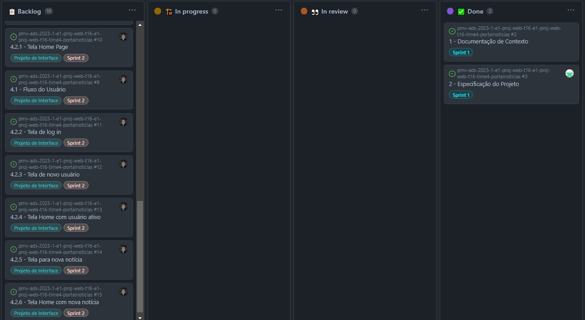
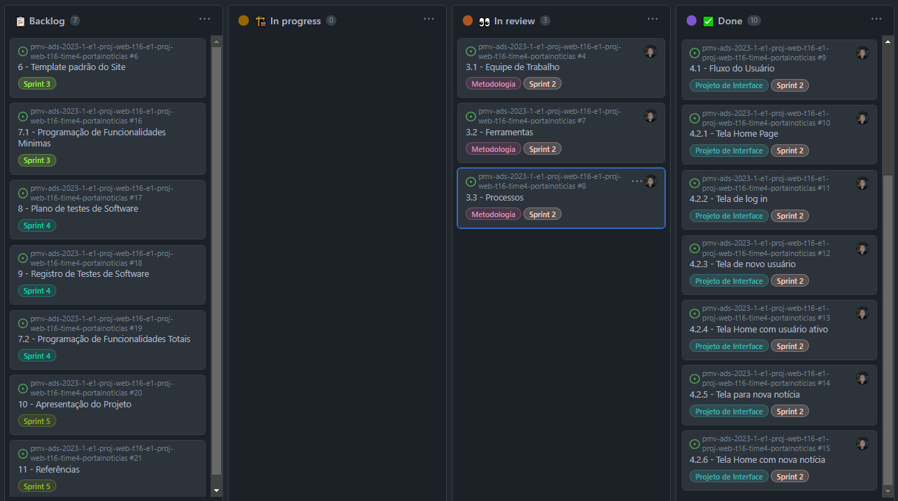

# Metodologia

A Metodologia é uma das partes mais importantes de um projeto. Pensando nisso, a equipe utiliza o Scrum como método base para desenvolvimento do projeto e divisão de artefatos. Também são utilizadas outras ferramentas como o **GitHub** e **Figma**. Sendo elas pensadas com o intuito de deixar organizado e prático.

 

## 1. Equipe de trabalho
___
A equipe utiliza métodos agéis para a realização do projeto, foi decidido a utilização do Scrum como base para definição do processo de desenvolvimento dos artefatos.

A distribuição da equipe foi feita da seguinte forma:

   - **Scrum Master:** Wilian Pereira 
   - **Product Owner:** Pedro Batista
   - **Equipe de Desenvolvimento:**
           João Ricardo
           - Luca Muller 
           - Pedro Aguilar
           - Pablo Nunes

 

## 2. Ferramentas
___
Os artefatos no projeto são desenvolvidos utilizando diversas plataformas e a relação de cada ambiente ao seu propósito é apresentada da seguinte forma:
| Ambiente                    | Plataforma  | Link de Acesso          |
|---------------------------- | ----------  | ----------------------- |
| Repositório de código fonte | GitHub      | [Repositório Github](https://github.com/ICEI-PUC-Minas-PMV-ADS/pmv-ads-2023-1-e1-proj-web-t16-e1-proj-web-t16-time4-portalnoticias)  |
| Documentos do projeto       | GitHub      | [Repositório Github](https://github.com/ICEI-PUC-Minas-PMV-ADS/pmv-ads-2023-1-e1-proj-web-t16-e1-proj-web-t16-time4-portalnoticias)  |
| Projeto de interface        | Figma       | [Wireframe](https://www.figma.com/proto/tA1e1KaNdzU4UhxvCVDUpj/projeto_front_end_puc_wireframe_ads1?page-id=1%3A401&node-id=1-550&starting-point-node-id=1%3A550)                         |
| Gerenciamento do Projeto    | GitHub      | [GitHub Projects](https://github.com/orgs/ICEI-PUC-Minas-PMV-ADS/projects/421)                  |
 

## 3. Processos
___
### 3.1 Product Backlog

- Documentação do Contexto
- Especificação do Projeto
- Metodologia
- Projeto de Interface
- Template padrão do Site
- Programação de Funcionalidades
- Plano de testes de Software
- Registro de Testes de Software
- Apresentação do Projeto

### 3.2 Sprint 1:
- Documentação do Contexto
  - Problemas
  - Objetivos
  - Justificativa
  - Público-alvo
- Especificação do Projeto
  - Personas
  - História do Usuário
  - Requisitos do Sistema: Funcionais, não funcionais e restrições.

### 3.2.1 Planejamento:
 

 

### 3.2.2 Execução:

| Tarefa | Responsável |
| ------ | ----------- | 
| Documentação do Contexto | Wilian Pereira |
| Especificação do Projeto | Pedro Aguilar |
 

### 3.2.3 Evidências:
Links:
- [Documentação do Contexto](https://github.com/ICEI-PUC-Minas-PMV-ADS/pmv-ads-2023-1-e1-proj-web-t16-e1-proj-web-t16-time4-portalnoticias/blob/main/docs/01-Documenta%C3%A7%C3%A3o%20de%20Contexto.md)
- [Especificação do Projeto](https://github.com/ICEI-PUC-Minas-PMV-ADS/pmv-ads-2023-1-e1-proj-web-t16-e1-proj-web-t16-time4-portalnoticias/blob/main/docs/02-Especifica%C3%A7%C3%A3o%20do%20Projeto.md)

 

----------------------------------------------------------
### 3.3 Sprint 2:
- Metodologia
  - Equipe de trabalho
  - Ferramentas
  - Processos
- Projeto de Interface
  - Fluxo do usuário
  - Wireframes

### 3.3.1 Planejamento:
 

 

### 3.3.2 Execução:

| Tarefa | Responsável |
| ------ | ----------- | 
| Metodologia | Pedro Batista |
| Projeto de Interface | Pedro Batista |
 

### 3.3.3 Evidências:
Links:
- [Metodologia](https://github.com/ICEI-PUC-Minas-PMV-ADS/pmv-ads-2023-1-e1-proj-web-t16-e1-proj-web-t16-time4-portalnoticias/blob/main/docs/03-Metodologia.md)
- [Projeto de Interface](https://github.com/ICEI-PUC-Minas-PMV-ADS/pmv-ads-2023-1-e1-proj-web-t16-e1-proj-web-t16-time4-portalnoticias/blob/main/docs/04-Projeto%20de%20Interface.md)

 

----------------------------------------------------------
### 3.4 Sprint 3:
- Template padrão do Site
  - Tela principal
  - Tela de Log in
  - Tela de Criação de usuário
- Programação de Funcionalidades
  - Visualização de Funcionalidades

### 3.4.1 Planejamento:
 

 

### 3.4.2 Execução:

| Tarefa | Responsável |
| ------ | ----------- | 
| Template padrão do Site | Responsável |
| Programação de Funcionalidades | Responsável |
 

### 3.4.3 Evidências:
Links:
- [Template padrão do Site](https://github.com/ICEI-PUC-Minas-PMV-ADS/pmv-ads-2023-1-e1-proj-web-t16-e1-proj-web-t16-time4-portalnoticias/blob/main/docs/06-Template%20padr%C3%A3o%20do%20Site.md)
- [Programação de Funcionalidades](https://github.com/ICEI-PUC-Minas-PMV-ADS/pmv-ads-2023-1-e1-proj-web-t16-e1-proj-web-t16-time4-portalnoticias/blob/main/docs/07-Programa%C3%A7%C3%A3o%20de%20Funcionalidades.md)

 

----------------------------------------------------------
### 3.5 Sprint 4:
- Programação de Funcionalidades
  - Requisitos atendidos
  - Artefatos da funcionalidade
  - Estrutura de Dados
  - Instruções de acesso
- Plano de Testes de Software
  - Requisitos para realização dos testes de software
  - Testes funcionais
- Registro de Testes de Software
  - Resultados obtidos nos testes de software

### 3.5.1 Planejamento:
 

 

### 3.5.2 Execução:

| Tarefa | Responsável |
| ------ | ----------- | 
| Programação de Funcionalidades | Responsável |
| Plano de Testes de Software | Responsável |
| Registro de Testes de Software | Responsável |
 

### 3.5.3 Evidências:
Links:
- [Programação de Funcionalidades](https://github.com/ICEI-PUC-Minas-PMV-ADS/pmv-ads-2023-1-e1-proj-web-t16-e1-proj-web-t16-time4-portalnoticias/blob/main/docs/07-Programa%C3%A7%C3%A3o%20de%20Funcionalidades.md)
- [Plano de Testes de Software](https://github.com/ICEI-PUC-Minas-PMV-ADS/pmv-ads-2023-1-e1-proj-web-t16-e1-proj-web-t16-time4-portalnoticias/blob/main/docs/08-Plano%20de%20Testes%20de%20Software.md)
- [Registro de Testes de Software](https://github.com/ICEI-PUC-Minas-PMV-ADS/pmv-ads-2023-1-e1-proj-web-t16-e1-proj-web-t16-time4-portalnoticias/blob/main/docs/09-Registro%20de%20Testes%20de%20Software.md)

 

----------------------------------------------------------
### 3.6 Sprint 5:
- Apresentação do Projeto
  - Título do Projeto
  - Identidade Visual
    - Marca
    - Design
  - Conjunto de Slides
    - Estrutura
- Referências

### 3.6.1 Planejamento:
 

 

### 3.6.2 Execução:

| Tarefa | Responsável |
| ------ | ----------- | 
| Apresentação do Projeto | Responsável |
| Referências | Responsável |
 

### 3.6.3 Evidências:
Links:
- [Apresentação do Projeto](https://github.com/ICEI-PUC-Minas-PMV-ADS/pmv-ads-2023-1-e1-proj-web-t16-e1-proj-web-t16-time4-portalnoticias/blob/main/docs/10-Apresenta%C3%A7%C3%A3o%20do%20Projeto.md)
- [Referências](https://github.com/ICEI-PUC-Minas-PMV-ADS/pmv-ads-2023-1-e1-proj-web-t16-e1-proj-web-t16-time4-portalnoticias/blob/main/docs/11-Refer%C3%AAncias.md)
